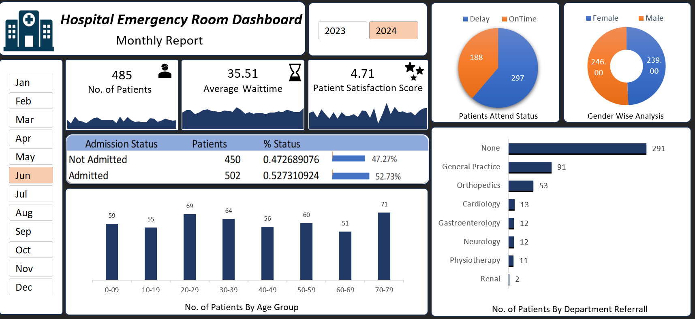

# 🏥 Hospital Emergency Room Dashboard (Excel)

## 📖 Overview
This project presents an interactive Excel dashboard analyzing emergency room data for 2023–2024.

The dashboard helps monitor patient flow, waiting time, admission status, and department referrals to support better decision-making.

---

## 🚀 Features
- Interactive Year and Month selection using slicers
- KPI metrics:
  - Total Patients
  - Average Wait Time
  - Patient Satisfaction Score
- Age group distribution analysis
- Admission vs Not Admitted breakdown
- Delay vs On-time patient status
- Department-wise referral analysis
- Gender distribution insights
- Navigation buttons for smooth user interaction

---

## 🛠️ Tools & Technologies
- Microsoft Excel
- Power Query (Data Cleaning & Transformation)
- Pivot Tables
- Slicers
- Chart Linking

---

## 📸 Dashboard Preview
-Dashboard: 

---

## 📊 Dataset
- Source: 
- Time Period: 2023–2024

---

## 🎯 Key Insights
- Majority of patients fall within the 20–39 age group
- Significant number of cases handled without department referral
- Patient wait time and satisfaction show noticeable variation
- Balanced gender distribution with slight variation

---

## 🔮 Future Improvements
- Integration with SQL database
- Real-time data updates
- Advanced analytics using Python

